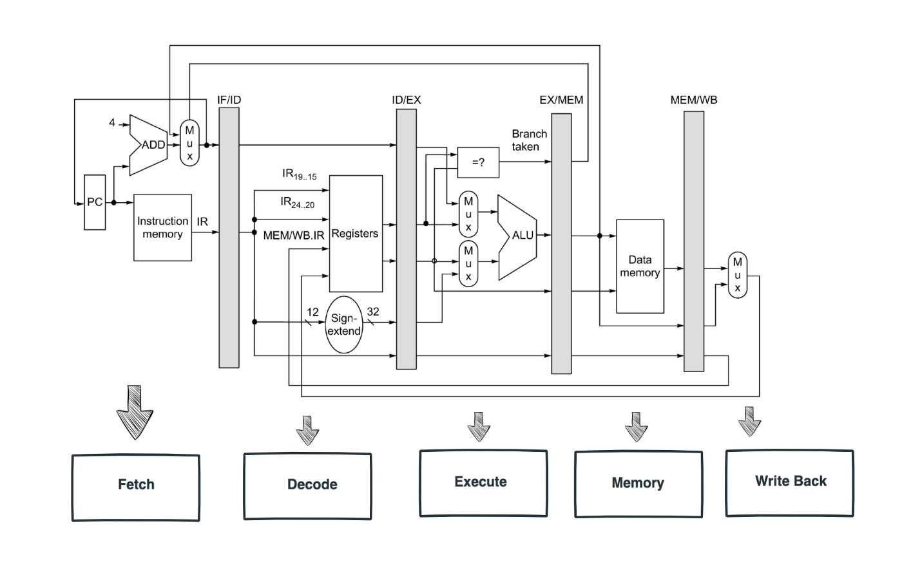
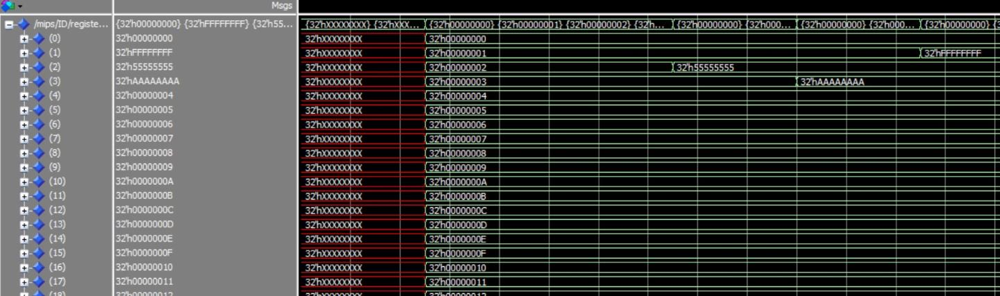
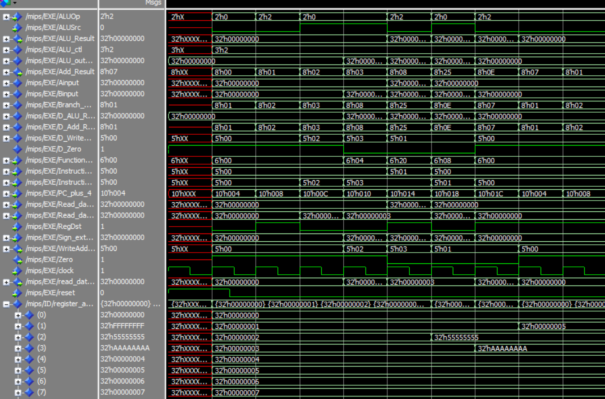
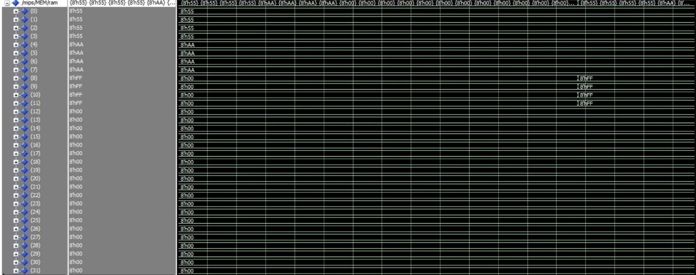
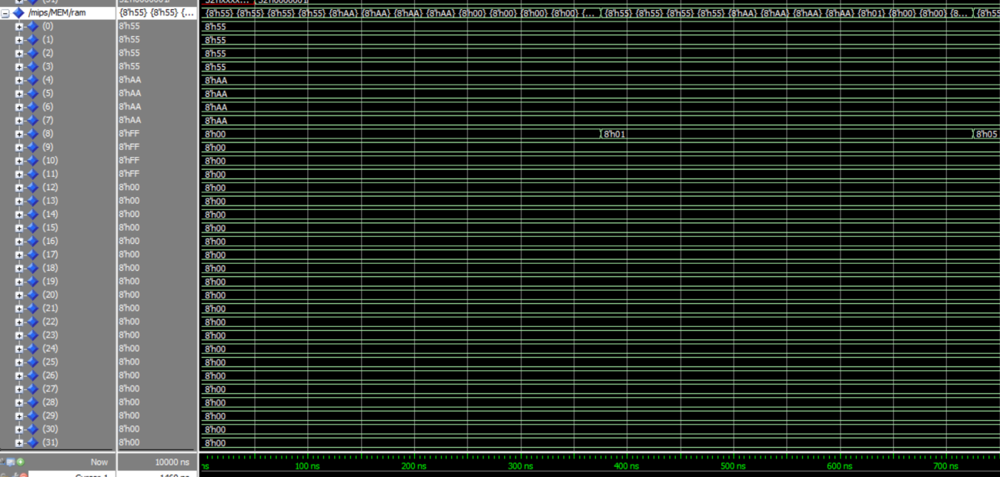

# MIPS Pipeline

# About
This is a basic MIPS fetch, decode, execute, memory, write-back pipeline


# Pipeline
```
ARCHITECTURE behavior OF Ifetch IS
TYPE INST_MEM IS ARRAY (0 to 8) of STD_LOGIC_VECTOR (31 DOWNTO 0);
SIGNAL iram : INST_MEM := (
X"00000000", -- nop
X"8C020000", -- lw $2,0 ;memory(00)=55555555
X"8C030004", -- lw $3,4 ;memory(04)=AAAAAAAA
X"00430820", -- add $1,$2,$3
X"AC010008", -- sw $1,3 ;memory(0C)=FFFFFFFF
X"00000000", -- nop
X"00000000", -- nop
X"1022FFFF", -- beq $1,$2,-4
X"1021FFFA" -- beq $1,$1,-24 (Assume delay slot present, so it
-- -- New PC = PC+4-24 = PC-20
);
```
Figure 1. Above contains the register memory that is use to test the pipeline


Figure 2. The resulting register array of the single cycle processor before the change to a pipeline
architecture. Notice the cycle delays in every instruction.


Figure 3. The ModelSim waveform of the resulting pipeline. As you can see instead of a clock cycle delay
from before now each instruction is pipelined one after the other resulting in a more efficient processor.
Notice the last value is not the addition of registers 2 and 3 as it says in the instruction memory from
Figure 1. This is because there is a read after write hazard and the registers 2 and 3 have not updated
from their default values. The processor as a result took the addition between the default values 2 and 3
yielding 5 inside of register 1.



Figure 4. Looking now at the memory of the non-pipelined single cycle processor the memory write
instruction doesn't take place until the 16th cycle.



Figure 5. Looking at the pipelined memory we can see that 5 which is the value from register 1 is written
to memory in 15 cycles which is a cycle less than before due to pipelining.


Figure 6. The picture above illustrates all the outputs from the MIPS module to show all the signals in
action.


# Conclusion
The pipelining architecture improved the overall performance of the processor by having instruction
execute one after the other. This led to an increase in overall throughput and a decrease in cycle per
instructions by a factor of almost 2. The processor, however, due to the nature of this lab not dealing
with hazards, the result of the pipeline writes back incorrect values if there are any data dependencies.
The overall intuition of this lab was to latch all the outputs of each individual stage and latch all the
control signals depending on how many stages used them and then afterwards resetting the latches
back to zero on a positive edge clock cycle.
